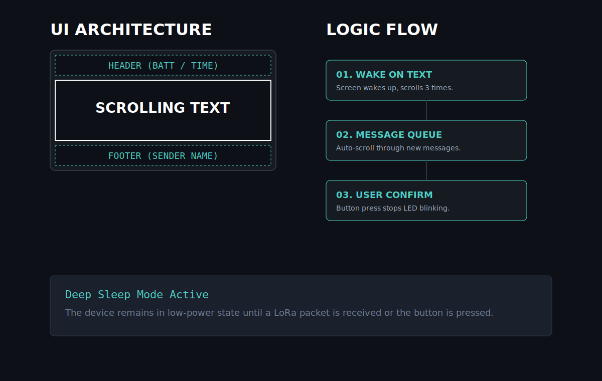

<div align="center">


<h1>Meshtastic Pager Mode Fork</h1>

<p><strong>Unofficial Meshtastic fork with pager-mode changes for Heltec V3, Heltec V4 and other small-screen targets.</strong></p>

<p>
  <a href="#english">English</a>
  ·
  <a href="#русский">Русский</a>
  ·
  <a href="release-work/README.md">Ready firmware</a>
  ·
  <a href="docs/pager-mode/README.md">Detailed EN guide</a>
  ·
  <a href="docs/pager-mode/README.ru.md">Подробный RU гайд</a>
</p>

</div>


## English

This repository is an **unofficial fork** of the Meshtastic firmware focused on a more practical **Pager Mode** experience for compact devices such as **Heltec V3**, **Heltec V4**, and other small-screen or e-ink targets.

It is a community fork maintained without commercial backing or financial motivation. A large part of the implementation and documentation was created with **AI assistance**. The maintainer works outside embedded development, so AI was used as a practical tool, not hidden authorship.

### What this fork is

- A fork of upstream Meshtastic, not a replacement for it
- A small-screen-first branch with focused UI changes
- A practical workspace for builds, packaging, and board-specific testing
- A project that should still be validated on real hardware before wider use

### What this fork changes

- Adds and refines `Pager Mode` for compact displays
- Carries the same idea into `InkHUD` on supported e-ink targets
- Keeps the device focused on the selected DM or channel while pager mode is active
- Uses long press to exit pager mode
- Persists pager mode across reboot
- Keeps message reading simple and foregrounded
- Improves readability of long messages
- Preserves as much upstream Meshtastic behavior as possible



### Build and release workflow

Ready firmware packages prepared in this workspace are collected in [release-work/README.md](release-work/README.md).

Current release-oriented targets:

- `heltec-v3`
- `heltec-v4`

### Build it yourself

Quick build:

```bash
pio run -e heltec-v3
pio run -e heltec-v4
```

Package release-style artifacts:

```bash
./bin/pager-package.sh heltec-v3 heltec-v4
```

Flash with the helper script:

```bash
./bin/pager-flash.sh --board heltec-v3 --port /dev/tty.usbmodemXXXX
./bin/pager-flash.sh --board heltec-v4 --port /dev/tty.usbmodemXXXX
```

### Notes

- This is not an official Meshtastic release.
- Board selection still matters. Flash only the image that matches the hardware exactly.
- Real-device testing is still required, especially for UI behavior and long-message handling.
- The detailed English guide is in [docs/pager-mode/README.md](docs/pager-mode/README.md).

---

## Русский

Этот репозиторий — **неофициальный форк** прошивки Meshtastic с более практичным **Pager Mode** для компактных устройств вроде **Heltec V3**, **Heltec V4** и других small-screen / e-ink плат.

Это community fork без коммерческой поддержки и без финансовой мотивации. Значительная часть кода и документации была сделана с помощью **искусственного интеллекта**. Это не скрывается: AI здесь использовался как рабочий инструмент, потому что сопровождающий проекта работает в другой области.

### Что это за проект

- Это форк upstream Meshtastic, а не замена оригиналу
- Это ветка с фокусом на маленькие экраны и точечные UI-изменения
- Это рабочий репозиторий для сборки, упаковки и проверки отдельных плат
- Это проект, который всё равно нужно проверять на реальном железе

### Что меняет форк

- Добавляет и дорабатывает `Pager Mode` для компактных экранов
- Переносит ту же идею в `InkHUD` для поддерживаемых e-ink устройств
- Фиксирует устройство на выбранном DM или канале, пока активен pager mode
- Позволяет выйти из pager mode длинным нажатием
- Сохраняет состояние pager mode после перезагрузки
- Делает чтение сообщений более простым и заметным
- Делает длинные сообщения более читаемыми
- Старается сохранить максимум совместимости с upstream

### Сборка и выпуск

Готовые локально собранные артефакты складываются в [release-work/README.md](release-work/README.md).

Основные release-цели:

- `heltec-v3`
- `heltec-v4`

### Как собрать самому

Быстрая сборка:

```bash
pio run -e heltec-v3
pio run -e heltec-v4
```

Упаковка артефактов:

```bash
./bin/pager-package.sh heltec-v3 heltec-v4
```

Прошивка через helper-скрипт:

```bash
./bin/pager-flash.sh --board heltec-v3 --port /dev/tty.usbmodemXXXX
./bin/pager-flash.sh --board heltec-v4 --port /dev/tty.usbmodemXXXX
```

### Примечания

- Это не официальный релиз Meshtastic.
- Перед прошивкой важно точно проверить соответствие `env` и платы.
- Проверка на реальном устройстве остаётся обязательной, особенно для UI и длинных сообщений.
- Подробная русская документация находится в [docs/pager-mode/README.ru.md](docs/pager-mode/README.ru.md).
