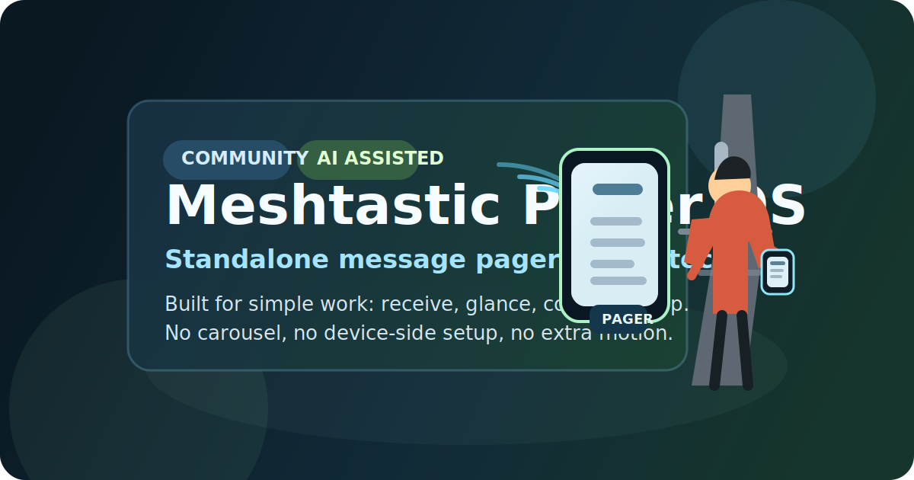

<div align="center">


<h1>Meshtastic Pager OS</h1>

<p><strong>Standalone pager-style firmware fork for Heltec V4, built on top of the Meshtastic radio stack.</strong></p>

<p>
  <a href="https://chemobook.github.io/meshtastic-pager-mode/">Web Flasher</a>
  ·
  <a href="#english">English</a>
  ·
  <a href="#русский">Русский</a>
  ·
  <a href="release-work/README.md">Firmware files</a>
  ·
  <a href="docs/pager-mode/README.md">Detailed EN guide</a>
  ·
  <a href="docs/pager-mode/README.ru.md">Подробный RU гайд</a>
</p>

</div>



## English

`Meshtastic Pager OS` is an unofficial fork of Meshtastic aimed at one job: receive text over LoRa and show it on a small OLED like a classic work pager.

This project is maintained by interested people without financial motivation. A meaningful part of the code and documentation was produced with AI assistance. That is intentional and not hidden: the maintainer works outside embedded development and used AI as a practical engineering tool.

### Concept

- Built for `Heltec V4` first
- Keeps Meshtastic radio, BLE configuration and mobile app workflow
- Removes the normal device-side UI, carousel and settings screens
- Treats the device as a simple pager, not a multi-screen handheld

This is useful when the device is clipped to clothing, gear, or a harness and the operator only needs short incoming text in harsh or busy conditions.

### Display model

The OLED is split into three fixed zones:

1. Header: battery and current time
2. Center: large horizontal scrolling message text
3. Bottom area: optional status surfaces when needed by the pager flow

The goal is simple reading at a glance. No menu browsing is required during normal use.

### Message logic

- Incoming text wakes the screen
- The message scrolls in the center area for the active display window
- If another message arrives while the screen is already active, the new message takes over and the timer resets
- Unread messages are tracked locally until the user confirms them with the hardware button
- Local message history is intentionally disposable and can be cleared completely

### Button and LED logic

- Short press on a sleeping screen wakes it and opens unread message review
- Further short presses confirm the current message and move through unread history
- Long press clears local pager history
- The white LED blinks for unread messages and slows down after the fast alert window

### What stays from Meshtastic

- BLE configuration through the official mobile app
- Channel and DM transport
- Existing radio stack, packet handling and device provisioning flow

### What is intentionally gone

- Standard screen carousel
- Device-side navigation as the main workflow
- “General purpose handheld” behavior on the OLED

### Flashing

The main user path is the browser flasher:

1. Open [Pager OS Web Flasher](https://chemobook.github.io/meshtastic-pager-mode/)
2. Use desktop Chrome or Edge
3. Choose `Heltec V4`
4. Flash from the browser and wait for reboot
5. If the board is not detected, replace the USB cable first and close other serial tools

Current packaged target exposed to users:

- `heltec-v4`

### Build

```bash
pio run -e heltec-v4
./bin/pager-package.sh heltec-v4
```

### Notes

- This is not an official Meshtastic release
- Real-device testing still matters
- The repo name may still mention the older pager-mode branch, but the active direction is now `Meshtastic Pager OS`

---

## Русский

`Meshtastic Pager OS` — это неофициальный форк Meshtastic, который теперь делается под одну простую задачу: принимать текст по LoRa и показывать его на маленьком OLED как классический рабочий пейджер.

Проект поддерживается заинтересованными людьми без финансовой выгоды. Значительная часть кода и документации была сделана с помощью AI. Это не скрывается: сопровождающий проекта работает в другой области и использует AI как практический инженерный инструмент.

### Концепция

- В первую очередь прошивка делается для `Heltec V4`
- Радиостек, BLE-настройка и работа через мобильное приложение Meshtastic сохраняются
- Обычный интерфейс устройства, карусель экранов и настройки с самого устройства убраны
- Устройство рассматривается как простой пейджер, а не как универсальный handheld

Такой подход нужен, когда устройство висит на одежде, разгрузке, рюкзаке или страховке, а пользователю важнее быстро увидеть входящий текст, чем листать экранные меню.

### Схема экрана

OLED разбит на три фиксированные зоны:

1. Верхняя строка: батарея и текущее время
2. Центральная зона: крупный бегущий текст сообщения
3. Нижняя зона: служебные поверхности, когда они нужны логике пейджера

Идея простая: сообщение должно читаться с первого взгляда. Постоянная навигация по меню не нужна.

### Логика сообщений

- Входящее сообщение будит экран
- Текст крутится в центральной зоне в течение активного окна показа
- Если во время показа приходит следующее сообщение, новое сообщение перехватывает экран и таймер сбрасывается
- Непрочитанные сообщения отслеживаются локально до подтверждения кнопкой
- Локальная история специально считается временной и может быть полностью очищена

### Логика кнопки и LED

- Короткое нажатие на спящем экране будит устройство и открывает просмотр непрочитанных сообщений
- Следующие короткие нажатия подтверждают текущее сообщение и листают историю непрочитанных
- Долгое удержание очищает локальную историю пейджера
- Белый светодиод мигает при наличии непрочитанных сообщений и затем замедляется

### Что сохраняется от Meshtastic

- Настройка через официальное мобильное приложение по BLE
- Работа каналов и DM
- Существующий радиостек, доставка пакетов и общий provisioning flow

### Что убрано специально

- Обычная экранная карусель
- Навигация по устройству как основной сценарий
- Поведение “универсального карманного устройства” на OLED

### Прошивка

Основной путь для пользователя сейчас такой:

1. Открыть [Pager OS Web Flasher](https://chemobook.github.io/meshtastic-pager-mode/)
2. Использовать настольный Chrome или Edge
3. Выбрать `Heltec V4`
4. Прошить устройство из браузера и дождаться перезагрузки
5. Если устройство не находится, сначала заменить USB-кабель и закрыть программы, которые держат serial-порт

Сейчас для пользователей подготовлена одна основная цель:

- `heltec-v4`

### Сборка

```bash
pio run -e heltec-v4
./bin/pager-package.sh heltec-v4
```

### Примечания

- Это не официальный релиз Meshtastic
- Проверка на реальном устройстве всё ещё обязательна
- Название репозитория пока может оставаться от старой ветки, но активная концепция проекта теперь называется `Meshtastic Pager OS`
